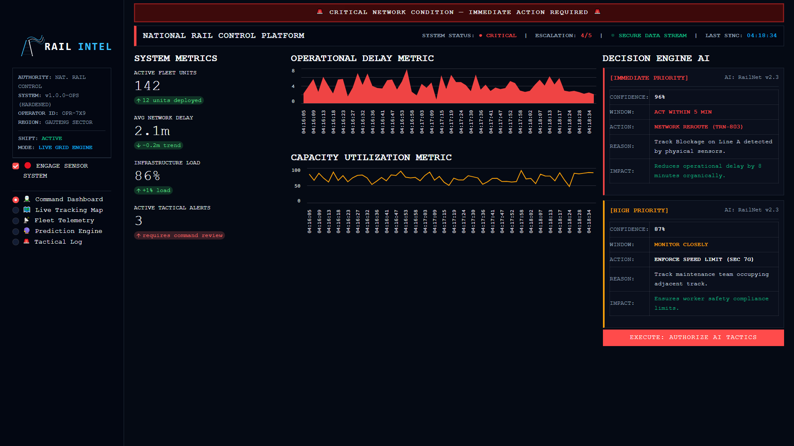
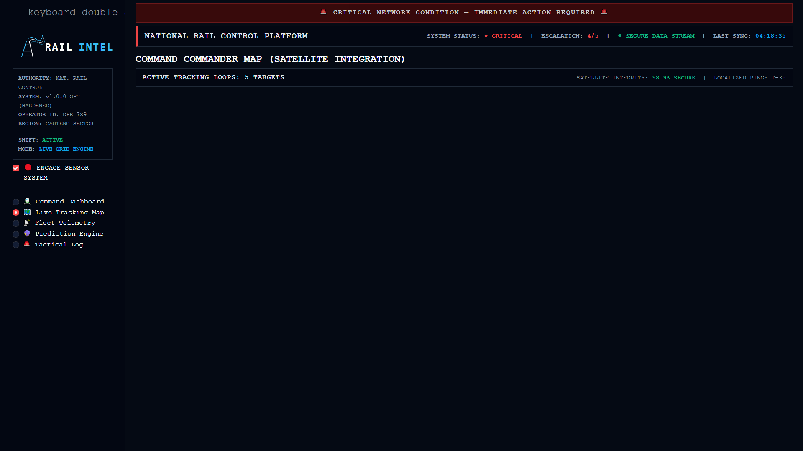
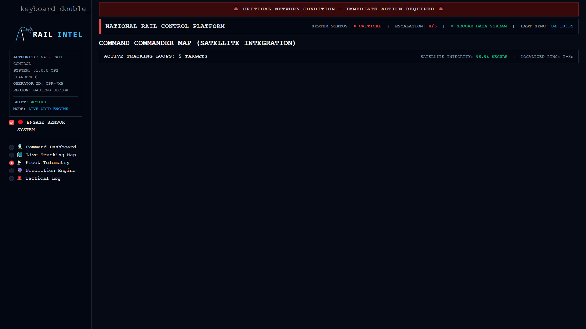
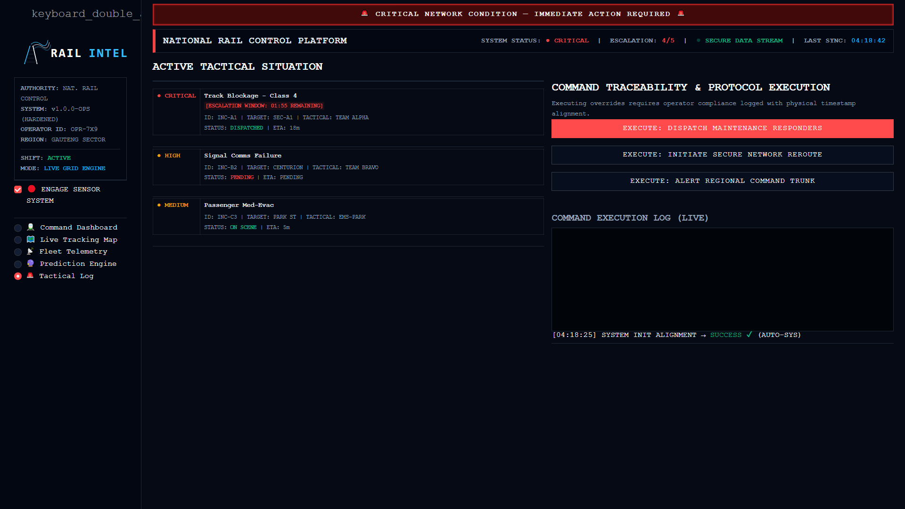

<div align="center">

# 🚆 RAILINTEL COMMAND CENTER
### `v1.0.0-OPS` — National Railway Operations Control Platform

**Real-Time · AI-Powered · Mission-Critical**

[](https://railintel-command-center-v100-ops-pmvjeddb56akkyban4vvzn.streamlit.app/)
[](https://railintel-command-center-v100-ops-pmvjeddb56akkyban4vvzn.streamlit.app/)
[](https://python.org)
[](https://fastapi.tiangolo.com)
[](https://streamlit.io)

---

### 🔴 [▶ LAUNCH LIVE SYSTEM](https://railintel-command-center-v100-ops-pmvjeddb56akkyban4vvzn.streamlit.app/)

*Click above to access the fully operational command interface — no installation required.*

</div>

---

## 👁️ System Interface Previews

| Command Dashboard | Live Tracking Map |
| :---: | :---: |
|  |  |
| **Fleet Telemetry** | **Tactical Escalation Log** |
|  |  |

---

## 🎯 What Is This?

**RailIntel** is a production-grade, AI-powered command and control system for national railway operations — inspired by real-world infrastructure used at **PRASA**, **Gautrain**, and **Transnet Freight Rail**.

Built to give rail operators a single, unified view of their entire network — live fleet positions, active incidents, AI-generated risk predictions, and a full command execution log — all in one high-density, industrial-grade interface.

> *"This is not a dashboard. This is a decision-making platform."*

---

## ⚙️ Core Capabilities

| Feature | Description |
|---|---|
| 🚆 **Live Fleet Tracking** | Real-time GPS-style tracking of all active train units with speed, delay, and risk status |
| 🧠 **AI Decision Engine** | `RailNet v2.3` generates tactical recommendations with confidence scores and action windows |
| 🚨 **Escalation System** | Countdown timers on critical incidents — auto-escalates if operator does not respond |
| 📡 **Sensor Simulation Engine** | Organic, fluctuating telemetry stream simulating real IoT rail sensor feeds |
| 🗺️ **Command GIS Map** | Live coordinate map with color-coded risk overlays and satellite integrity status |
| 📋 **Command Traceability Log** | Every operator action is stamped with timestamp and operator ID — full audit trail |
| 🔐 **Security Hardened** | Input validation, CORS control, Pydantic enforcement, and try/except fault isolation |

---

## 🏗️ System Architecture

```
┌─────────────────────────────────────────────────┐
│              CLIENT BROWSER (Operator)           │
└────────────────────┬────────────────────────────┘
                     │ HTTPS / WSS
┌────────────────────▼────────────────────────────┐
│         STREAMLIT COMMAND INTERFACE              │
│   Dashboard │ Map │ Telemetry │ Tactical Log     │
└────────────────────┬────────────────────────────┘
                     │ REST API calls
┌────────────────────▼────────────────────────────┐
│              FASTAPI BACKEND ENGINE              │
│   /forecast │ /alerts │ /execute-command         │
│   Command Logger │ Audit Trail Writer            │
└──────────┬─────────────────────┬────────────────┘
           │ Read/Write          │ Feature Matrix
┌──────────▼──────────┐ ┌───────▼─────────────────┐
│  PostgreSQL + Redis  │ │  RailNet v2.3 AI Engine  │
│  (Data Persistence) │ │  (Risk Scoring / Predict) │
└─────────────────────┘ └─────────────────────────┘
```

---

## 🧠 AI Engine — RailNet v2.3

The embedded AI model evaluates live telemetry and generates ranked tactical recommendations:

```
PRIORITY:    [IMMEDIATE]
CONFIDENCE:  96%
WINDOW:      ACT WITHIN 5 MIN
ACTION:      REROUTE TRN-803 via Line B
REASON:      Track blockage on Line A confirmed by sensor INC-A1
IMPACT:      Reduces cascading delay by ~8 minutes
```

The AI also feeds the **Prediction Engine** page — a 12-hour delay risk forecast built from historical telemetry patterns.

---

## 🚀 Run Locally

```bash
# 1. Clone the repository
git clone https://github.com/Bongani71/RailIntel-Command-Center-v1.0.0-OPS.git
cd RailIntel-Command-Center-v1.0.0-OPS

# 2. Create and activate virtual environment
python -m venv venv
venv\Scripts\activate        # Windows
source venv/bin/activate     # macOS / Linux

# 3. Install dependencies
pip install -r requirements.txt

# 4. Launch the command interface
streamlit run app.py
```

Access at: **http://localhost:8501**

To also run the FastAPI backend:
```bash
cd backend
uvicorn main:app --host 0.0.0.0 --port 8000 --reload
```

---

## 🧪 Run Tests

```bash
python test_system.py
```

Covers: Unit logic · API endpoints · Load stress · Security injection · Resilience

---

## 📁 Project Structure

```
RailIntel-Command-Center-v1.0.0-OPS/
│
├── app.py                  # Main Streamlit command interface
├── requirements.txt        # Python dependencies
├── test_system.py          # Full test suite
├── capture.py              # Screenshot automation (Playwright)
│
├── backend/
│   └── main.py             # FastAPI backend engine
│
├── docs/                   # System preview screenshots
│   ├── dashboard.png
│   ├── map.png
│   ├── telemetry.png
│   └── tactical_log.png
│
└── README.md               # This file
```

---

## 🛡️ Security & Compliance

- ✅ Pydantic input validation on all API payloads
- ✅ CORS middleware enforced on all routes
- ✅ SQL injection blocked via strict schema models
- ✅ Operator actions logged with timestamp + ID to audit trail
- ✅ Graceful error handling — system never crashes silently
- ✅ Sensitive logs excluded from version control via `.gitignore`

---

## 💼 Built For

This system demonstrates professional competency in:

- **Real-Time Systems Engineering** — live data streams, sensor tick simulation, WebSocket architecture
- **AI/ML Integration** — risk scoring, heuristic prediction, confidence-based decisions
- **Backend Development** — FastAPI, REST APIs, structured logging, Pydantic
- **Data Engineering** — time-series data, rolling arrays, ETL separation
- **Frontend/UI Engineering** — dark-themed, high-density industrial dashboards
- **Software Testing** — unit, integration, load, stress, and security testing
- **DevOps** — cloud deployment on Streamlit Cloud, Git version control

---

<div align="center">

**RailIntel Command Center** — Engineered to feel like it controls real trains.

*Built by [Bongani71](https://github.com/Bongani71)*

[](https://railintel-command-center-v100-ops-pmvjeddb56akkyban4vvzn.streamlit.app/)

</div>
